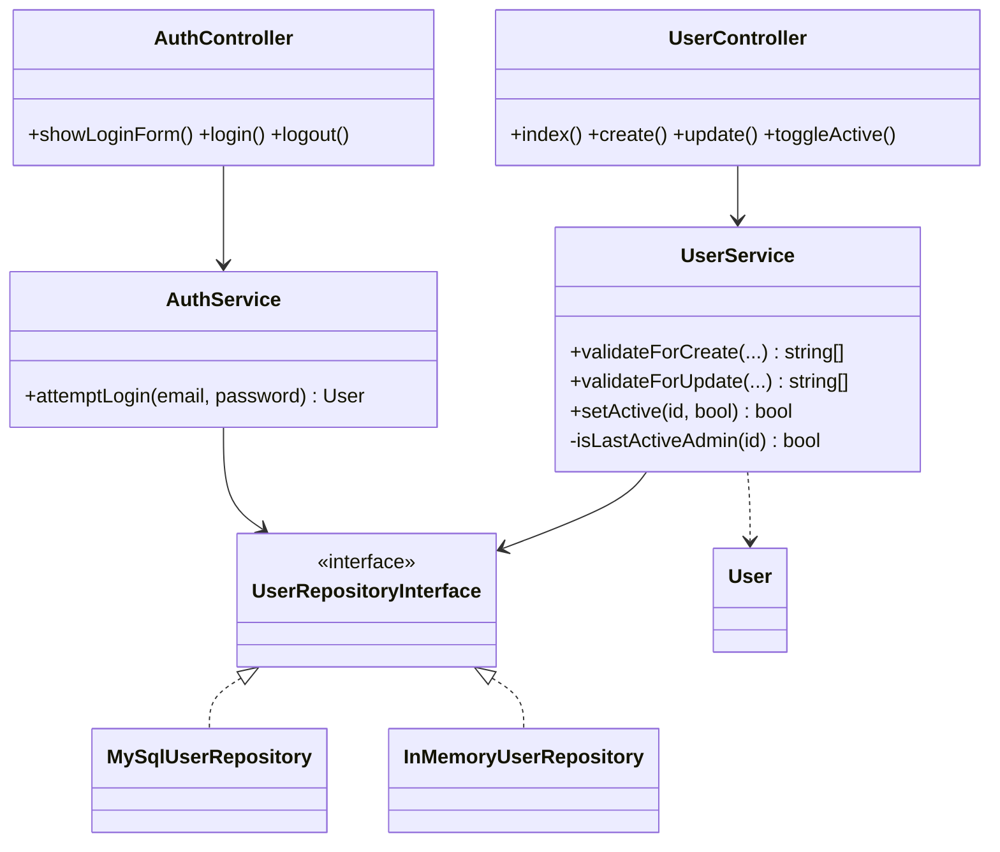
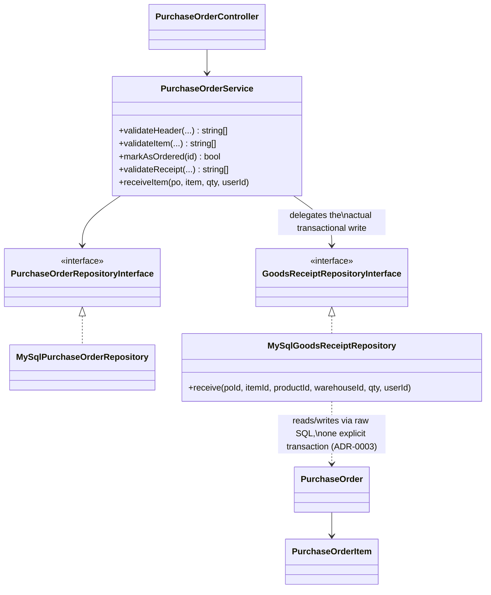
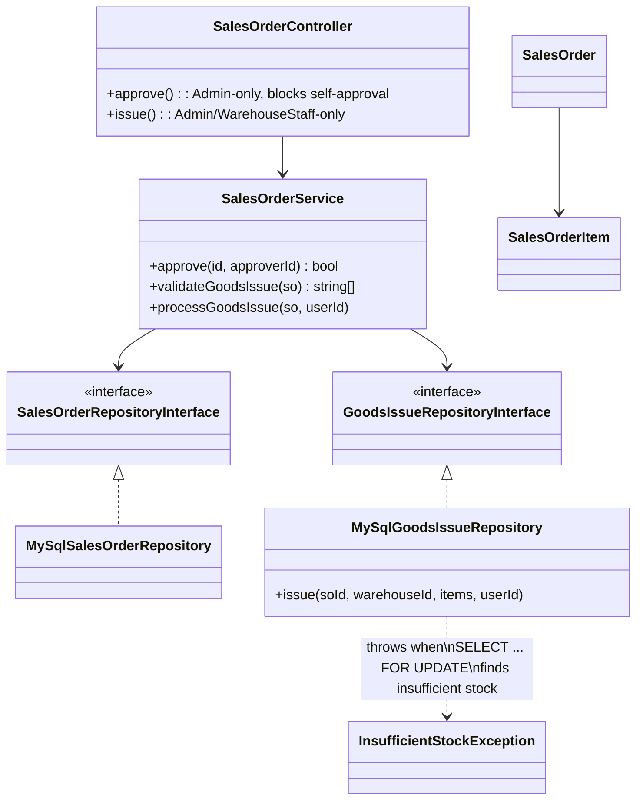
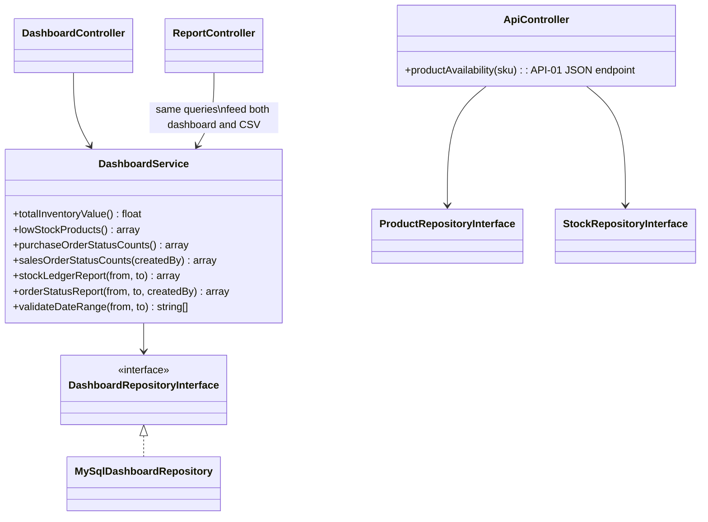

# Class Diagram — As-Built

Split by module for readability, rather than one unreadable diagram of the
whole system. Every module follows the same shape: Controller → Service →
Repository interface ← implementation(s) → Entity. Solid arrows with a
hollow triangle (`<|..`) mean "implements this interface"; plain arrows
mean "depends on / constructs".

## Auth & User



`InMemoryUserRepository` only exists for `tests/Unit/`; the running
application always constructs `MySqlUserRepository` (see
`public/index.php`).

## Master Data (Category, Warehouse, Product + Stock, Supplier, Customer)

```mermaid
classDiagram
    class CategoryController
    class WarehouseController
    class ProductController
    class SupplierController
    class CustomerController

    class CategoryService
    class WarehouseService
    class ProductService {
        +validate(...) string[]
        +createProduct(...) Product
    }
    class SupplierService
    class CustomerService

    class CategoryRepositoryInterface { <<interface>> }
    class WarehouseRepositoryInterface { <<interface>> }
    class ProductRepositoryInterface { <<interface>> }
    class StockRepositoryInterface { <<interface>> }
    class SupplierRepositoryInterface { <<interface>> }
    class CustomerRepositoryInterface { <<interface>> }

    class MySqlCategoryRepository
    class MySqlWarehouseRepository
    class MySqlProductRepository
    class MySqlStockRepository
    class MySqlSupplierRepository
    class MySqlCustomerRepository

    CategoryController --> CategoryService --> CategoryRepositoryInterface
    WarehouseController --> WarehouseService --> WarehouseRepositoryInterface
    ProductController --> ProductService
    ProductService --> ProductRepositoryInterface
    ProductService --> CategoryRepositoryInterface : validates category exists
    ProductService --> StockRepositoryInterface : initializes stock rows
    SupplierController --> SupplierService --> SupplierRepositoryInterface
    CustomerController --> CustomerService --> CustomerRepositoryInterface

    CategoryRepositoryInterface <|.. MySqlCategoryRepository
    WarehouseRepositoryInterface <|.. MySqlWarehouseRepository
    ProductRepositoryInterface <|.. MySqlProductRepository
    StockRepositoryInterface <|.. MySqlStockRepository
    SupplierRepositoryInterface <|.. MySqlSupplierRepository
    CustomerRepositoryInterface <|.. MySqlCustomerRepository
```

`ImageUploader` (in `app/Support/`) is used directly by `ProductController`
for file validation/storage — it's infrastructure, not a Repository, so it
sits outside this persistence diagram.

## Purchase Order & Goods Receipt



## Sales Order, Approval & Goods Issue (ARCH-02)



## Dashboard & Reports



## Shared cross-cutting classes

`App\Support\AuthGuard` (session/role checks), `App\Support\Database`
(the one PDO factory, with startup-retry logic), `App\Support\DateValidator`
(shared date-format check, see refactor-log entry 2), and
`App\Support\ImageUploader` don't belong to any one module — every
Controller and several Repositories depend on `Database`; every protected
Controller action calls `AuthGuard`.

## What changed since the initial diagram

The initial diagram (`docs/planning/class-diagram-initial.md`) only covered
the Auth module, sketched before any other feature existed. Two things
changed as the rest of the system was built: (1) the Repository pattern
proven there with `User` was **not** repeated with a fake/in-memory twin
for every other entity — only `User` has one, since ARCH-01 only requires
proving the pattern once and duplicating it everywhere would be
unjustified boilerplate; and (2) two new interfaces
(`GoodsReceiptRepositoryInterface`, `GoodsIssueRepositoryInterface`) were
introduced that don't fit the plain CRUD shape at all — each wraps one
multi-table, explicitly-transactional write, which the initial sketch
had no way to anticipate before ARCH-02's concurrency requirement was
worked through (see ADR-0002 and ADR-0003).
