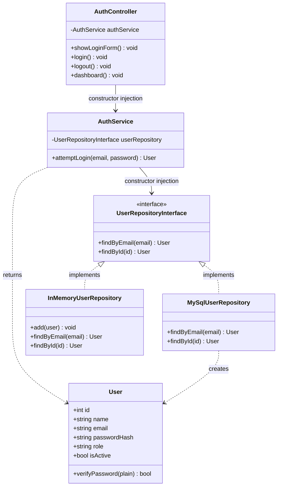

# Class Diagram — Initial (Auth Module)

Created at the start of Phase 1, before any other module (master data,
PO, SO) was added. The as-built diagram is created in
`docs/architecture/` at the end of the project, with notes on what
changed and why.

## Design notes

- Dependencies point from Controller → Service → Repository interface,
  never the other way around (ARCH-01).
- `AuthService` doesn't know whether user data comes from MySQL or the
  in-memory fake — that's why it can be tested without a real PDO
  connection (see `tests/Unit/AuthServiceTest.php`).
- The session (`$_SESSION`) is only touched in `AuthController`, never
  in `AuthService` — so the login business logic can still be tested
  outside an HTTP context.
