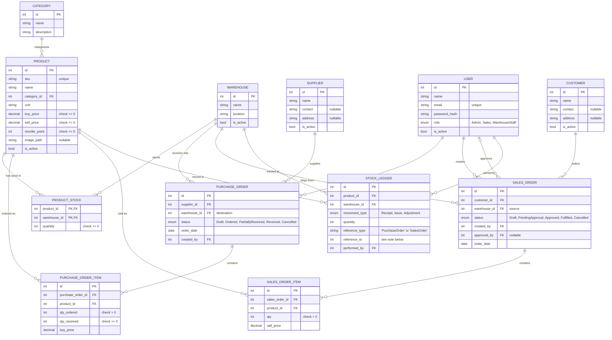

# Entity Relationship Diagram

Built directly from `database/schema-and-seed.sql` — every table, column, and
foreign key below matches the real schema exactly (not a planning sketch
that later drifted from the code).

*(Gambar PNG di atas — render langsung dari struktur schema, dijamin tampil di
viewer manapun tanpa butuh dukungan Mermaid. Garis merah = `ON DELETE
RESTRICT`, garis hijau = `ON DELETE CASCADE`.)*

Kode sumber di bawah ini (format Mermaid) disimpan supaya diagramnya tetap
bisa diedit di masa depan — kalau viewer kamu mendukung Mermaid (GitHub,
banyak plugin VS Code), versi di bawah ini akan ikut ter-render juga.

## Notes on design decisions

- **`PRODUCT_STOCK` has a composite primary key** (`product_id`,
  `warehouse_id`) rather than its own surrogate `id` — a product's stock
  in a given warehouse is a single fact, not a collection of rows, so
  there's nothing to give a separate identity to. This is what
  `WH-01`'s "stok berbeda di tiap gudang" is represented as: one row per
  product-warehouse pair, updated in place, never inserted twice for the
  same pair (`INSERT IGNORE` is used when initializing new stock rows).

- **`STOCK_LEDGER.reference_id` is deliberately *not* a real foreign
  key.** It points to either a `purchase_order.id` or a `sales_order.id`
  depending on `reference_type` — a polymorphic reference. MySQL can't
  express "this FK points to table A when column X = 'PurchaseOrder', or
  table B when X = 'SalesOrder'" as an enforced constraint, so this one
  relationship is validated in application code (`MySqlGoodsReceiptRepository`
  / `MySqlGoodsIssueRepository`) instead of by the database. Every other
  foreign key in this schema *is* a real, enforced `FOREIGN KEY`
  constraint (see DB-01).

- **`SALES_ORDER.approved_by` is nullable and the relationship to `USER`
  is zero-or-one** (`|o--o{` above), unlike `created_by` which is always
  required. A Draft or PendingApproval order simply has no approver yet.

- **No FK constraint links `USER` to itself for the "creator can't
  approve their own order" rule** — that's a business rule
  (`SalesOrderService::approve()`), not a structural one, since both
  `created_by` and `approved_by` point to the same `user` table and the
  database has no native way to say "must not be the same row as another
  column in a different table's row." This is exactly the kind of rule
  ARCH-01 pushes into the Service layer rather than the schema.

## Table-to-module map

| Table(s) | Module | Brief requirement |
|---|---|---|
| `user` | Auth & User | AUTH-01, AUTH-02, USR-01 |
| `category`, `warehouse`, `supplier`, `customer` | Master Data | PRD-01 (partial), WH-01 |
| `product`, `product_stock` | Master Data | PRD-01, WH-01 |
| `purchase_order`, `purchase_order_item` | Purchasing | PO-01 |
| `sales_order`, `sales_order_item` | Sales | SO-01 |
| `stock_ledger` | Shared by both | ARCH-02, DB-01 |
